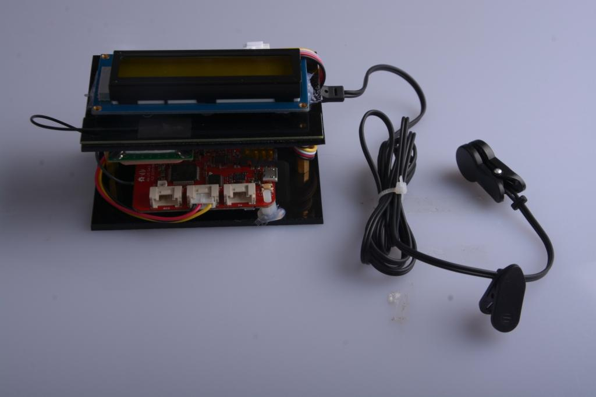
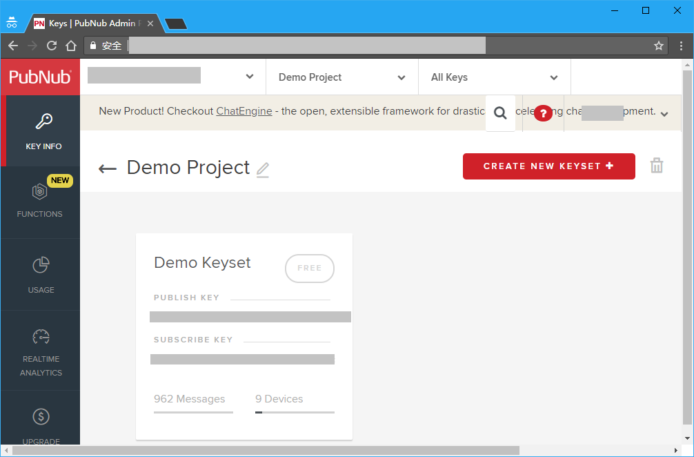
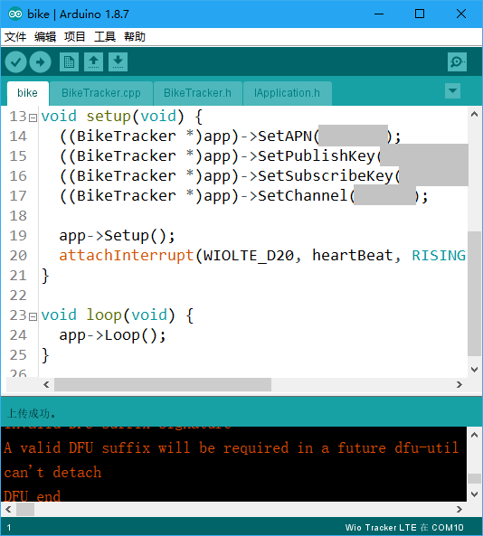
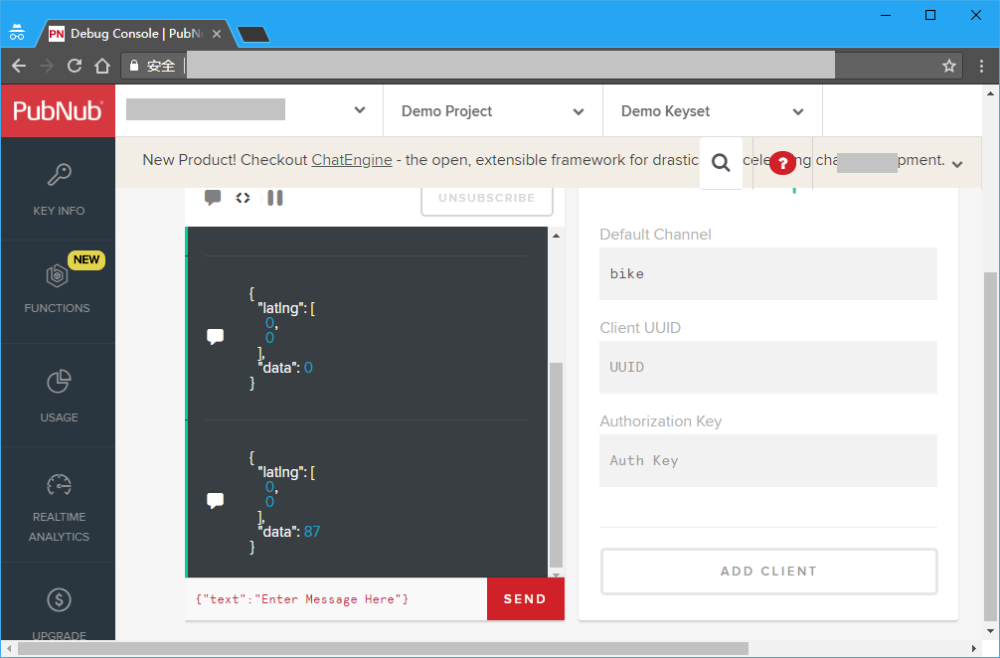
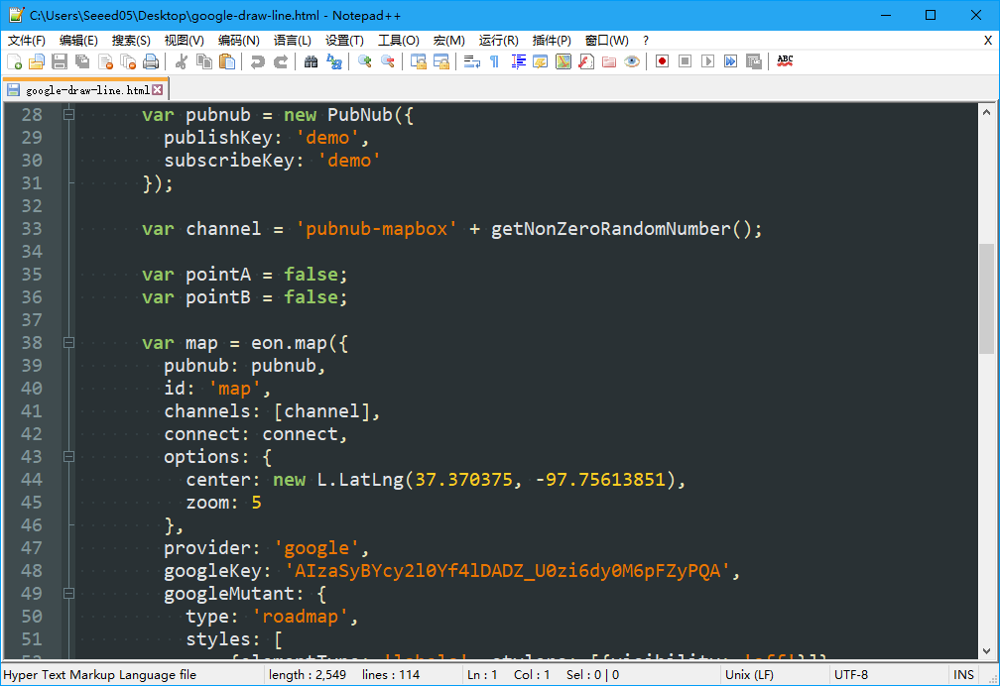
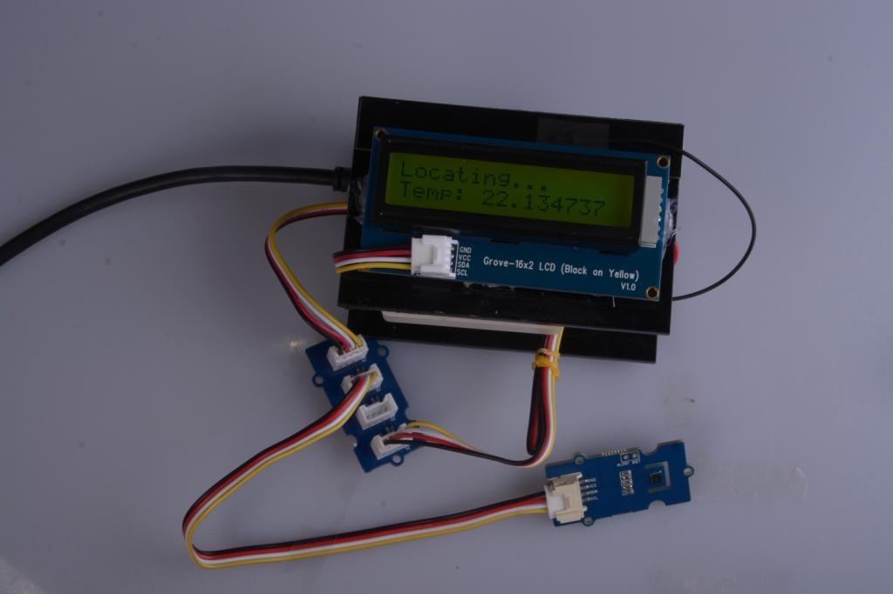
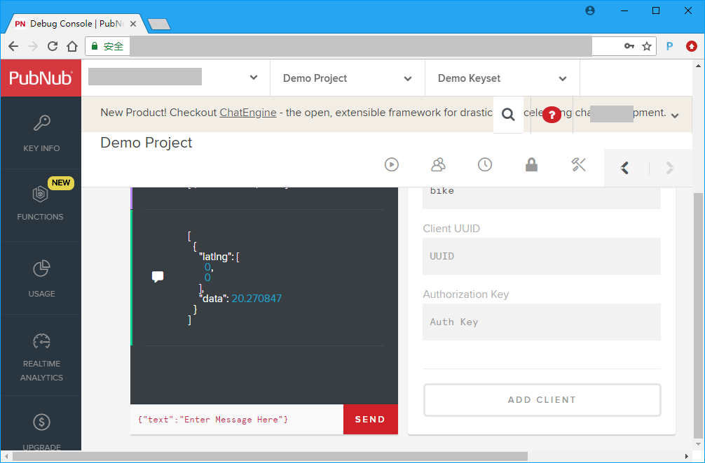

# Tracking bike using Google Map

We usually want to record various data during biking, this time we used new Wio LTE to track them.

## Things used in this project

### Hardware components

- Wio LTE Cat.1
- Grove-16x2 LCD
- Grove - Ear-clip Heart Rate Sensor

### Software apps and online services

- Arduino IDE
- PubNub
- Google Map

## Story

### Hardware connection

Install GPS and LTE Antennas to Wio LTE and plug your SIM card to it. Connect Ear-clip Heart Rate Sensor and 16x2 LCD to Wio LTE's D20 and I2C port.

You can change Ear-clip Heart Rate Sensor to other sensors you like, please see the end of this article.

### Web Configuration

**Part 1. PubNub**

Click [here](https://www.pubnub.com/) login or register a PubNub account, PubNub is used to transmit real-time data to map.

Open Demo Project in PubNub Admin Portal, you will see a Publish Key and a Subscribe Key, remember them for Software Programming.  

**Part 2. Google Map**

Please follow [here](https://developers.google.cn/maps/documentation/javascript/get-api-key?hl=zh-cn) to get a Google Map API Key, it will be used in Sofware Programming too.

### Software Programming

**Part 1. Wio LTE**

Because there is no PubNub library for Wio LTE, we can send our data from HTTP request, see [PubNub REST API Document](https://www.pubnub.com/docs/pubnub-rest-api-documentation#publish-subscribe-publish-v1-via-get-get).

To make a HTTP connection via your SIM card pluged in Wio LTE, you should set your APN first, if you don't know that, please contact your mobile operators.

And then, set your PubNub Publish Key, Subscribe Key and Channel. The channel here, is used to differentiate Publishers and Subscribers. For example, we use channel *bike* here, all Subcribers in channel *bike* will receive messages we published. 

The settings above, we didn't packed in class, so that you can modify them in *bike.ino* easier, you can download these codes from the end of this article. 

**Part 2. PubNub**

Press and hold Boot0 key in Wio LTE, connect it to your computer via an USB cable, upload the program in Arduino IDE, press Reset key in Wio LTE.

Then turn to PubNub, click Debug Console in Demo Project, fill your channel's name in Default Channel, click Add Client.

When you see *[1,"Subscribed","bike"]* in console, the Subscriber was successfully added. Wait for a while, you will see Wio LTE data appear in console. 

**Part 3. Google Map**

ENO Maps are real-time maps with PubNub and MapBox, it can also be used for PubNub and Google Map, you can download it from it's [GitHub](https://github.com/pubnub/eon-map/).

You can simply use a example named google-draw-line.html in examples folder, just modify Publish Key, Subscribe Key, Channel and Google Key in line 29, 30, 33 and 47.

*NOTICE: Please comment line 42, or it will send simulation data to your PubNub.*

If you want to display heart rate chart in the bottom right coener, you can use Chart.js, it can be downloaded from it's [Website](https://www.chartjs.org/), put it in ENO Maps' root folder, and include it to google-draw-line.html's head.

	<head>
		<!-- ... -->
		

		<!-- ... -->
	</head>

And add a canvas in a div to display chart:

	<body>
		<!-- ... -->
		

			<canvas id="chart"></canvas>
		

		<!-- ... -->
	</body>

Then create two arrays to keep chart data

	

among them, chartLabels is used to keep location data, chartData is used to keep heart rate data. When messages come, push new data to them, and refresh the chart.

	

All done. Try to take it with your biking next time.

### How to work with other Sensor Grove?

In Wio LTE's program, you can take one and more custom data to display in chart or do more. The following article shows how to modify the program to achieve it.

The first thing you need to know is, the json you want to publish to PubNub, should be url-encoded. Encoded json is hard-coded in BikeTracker class, it looks like this:

	%%5b%%7b%%22latlng%%22%%3a%%5b%f%%2c%f%%5d%%2c%%22data%%22%%3a%d%%7d%%5d

So it's easy to take one custom data, or you can use url-encode tools to make your own encoded json to take more data.

This time we try to use I2C High Accracy Temp & Humi Grove to replace Heart Rate Grove. Because the LCD Grove also use I2C, we use an I2C Hub to connect Temp & Humi Grove and LCD Grove to Wio LTE.

then include head file to BickTracker.h, and add a varible and a method to BikeTracker class to store and measure temperature.

	/// BikeTracker.h
	// ...
	#include "Seeed_SHT35.h"
	
	class application::BikeTracker
		: application::interface::IApplication {
		// ...
		
	proteced:
		// ...
		SHT35 _sht35;
		float _temperature;
		
		// ...
		void MeasureTemperature(void);
	} 
	
	/// BikeTracker.cpp
	// ...
	// BikeTracker::BikeTracker(void) 
	//	: _ethernet(Ethernet()), _gnss(GNSS()) { }
	// 21 is the SCL pin number
	BikeTracker::BikeTracker(void) 
		: _ethernet(Ethernet()), _gnss(GNSS()), _sht35(SHT35(21)) { }

	// ...
	void BikeTracker::measureTemperature(void) {
		float temperature, humidity;
		if (_sht35.read_meas_data_single_shot(HIGH_REP_WITH_STRCH,&temperature,&humidity) == NO_ERROR) {
			_temperature = temperature;
		}
	}

	// ...

If you want, you can change LCD's display in Loop() method:

	// sprintf(line2, "Heart Rate: %d", _heartRate);
	
	MeasureTemperature();
	sprintf(line2, "Temp: %f", _temperature);

But how to publish it to PubNub? You need to change encoded json and sprintf() function's parameters in PublishToPubNub() method, let it looks like this:

	// sprintf(cmd, "GET /publish/%s/%s/0/%s/0/%%5b%%7b%%22latlng%%22%%3a%%5b%f%%2c%f%%5d%%2c%%22data%%22%%3a%d%%7d%%5d?store=0 HTTP/1.0\n\r\n\r",
	//	_publishKey, _subscribeKey, _channel, _latitude, _longitude, _heartRate);
	sprintf(cmd, "GET /publish/%s/%s/0/%s/0/%%5b%%7b%%22latlng%%22%%3a%%5b%f%%2c%f%%5d%%2c%%22data%%22%%3a%f%%7d%%5d?store=0 HTTP/1.0\n\r\n\r", 
		_publishKey, _subscribeKey, _channel, _latitude, _longitude, _temperature);

then you can see temperature in PubNub debug console.

