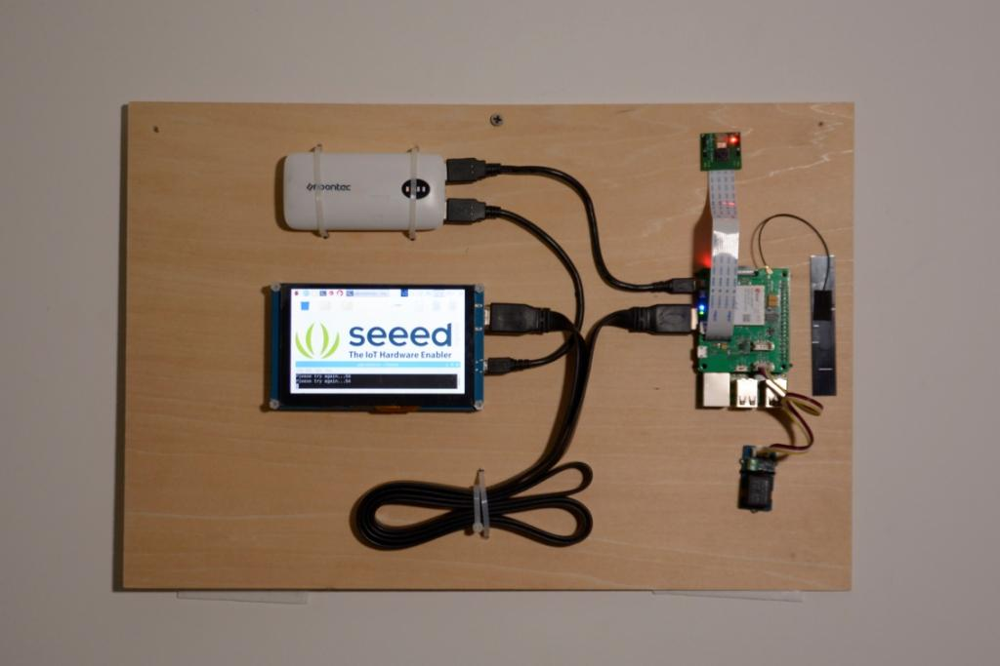
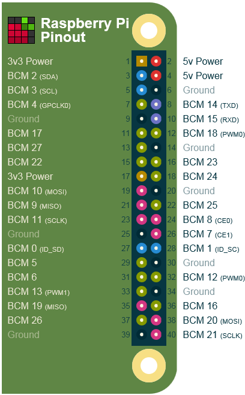

# Face recognisation Smart Lock with LTE Pi HAT


Face recognition is becoming more and more widely used, we can use it to make a smart lock.

## Things used in this project
### Hardware components
- Raspberry Pi 3B
- Raspberry Pi Camera
- Grove - Relay
- LTE Cat 1 Pi Hat
- 5'' 800X480 HDMI DISPLAY
### Software apps
- VNC Viewer
- WinSCP
- Notepad++

## Story

### Hardware Connection

In this project, we plan to take pictures with picamera and recognise faces in them, then display recognition result in the screen. If faces known, open the door, and send who opened the door to specified phone number via SMS.

So you need to connect a camera to Raspberry Pi's camera interface, install antenna and Grove - Relay to LTE Pi hat, and plug hat to your Raspberry Pi. Screen can be connected to Pi via a HDMI cable, don't forget connect power to your screen and Raspberry Pi.

### Software Programming
**Face Recognition**

Thanks for [Adam Geitgey](ageitgey) and his [Face Recognition](https://github.com/ageitgey/face_recognition) Project, we can use the world's simplest face recognition library on Raspberry Pi. The following steps will show you how to setup face recognition on Pi.

step 1. Use raspi-config to configure camera and GPU memory. 
```
sudo raspi-config
```

Choosing _Interface Options_ -- _Camera_ to enable picamera, and choosing _Advanced Options_ -- _Memory Split_ to set GPU memory, it should be changed to 64. After finishing, reboot your Raspberry Pi.

Step 2. Install required libraries.
```
sudo apt-get update
sudo apt-get upgrade
sudo apt-get install build-essential \
    cmake \
    gfortran \
    git \
    wget \
    curl \
    graphicsmagick \
    libgraphicsmagick1-dev \
    libatlas-dev \
    libavcodec-dev \
    libavformat-dev \
    libboost-all-dev \
    libgtk2.0-dev \
    libjpeg-dev \
    liblapack-dev \
    libswscale-dev \
    pkg-config \
    python3-dev \
    python3-numpy \
    python3-picamera \
    python3-pip \
    zip
sudo apt-get clean
```

Step 3. Make picamerea supports array.
```
sudo pip3 install --upgrade picamera[array]
```

Step 4. Install dlib and face recognition.
```
sudo pip3 install dlib
sudo pip3 install face_recognition
```

Step 5. Download and run face recognition example
```
git clone --single-branch https://github.com/ageitgey/face_recognition.git
cd ./face_recognition/examples
python3 facerec_on_raspberry_pi.py
```

_NOTICE: If you got ImportError: libatlas.so.3: cannot open shared object file: No such file or directory, run following command to fix it._
```
sudo apt-get install libatlas3-base
```

**Relay**

When face recognition is ready, we can continue to add additional features. We connected Grove - Relay to LTE Cat 1 Pi HAT, but it use digital port rather than I2C port. 

This is pinout for Raspberry Pi 3B, we can see SDA pin and SCL pin located in board's pin 3 and pin 5. 



So we can control relay by outputs digital signal to pin 5. Run following down python program on your Raspberry Pi, if nothig goes wrong, you will hear a Ti-Ta from relay.

```
import RPi.GPIO as GPIO

RELAY_PIN = 5

GPIO.setmode(GPIO.BOARD)
GPIO.setup(RELAY_PIN, GPIO.OUT)

GPIO.output(RELAY_PIN, GPIO.HIGH)
```

So here is the idea, we load known faces from a folder, recognise faces captured by picamera, if the face in the folder, control relay to unlock the door. We can package them to a class, here is load_known_faces() method and unlock() method, the completed program can be downloaded in the end of this article.

```
def load_known_faces(self):
    known_faces = os.listdir(self.__known_faces_path)
    
    for known_face in known_faces:
        self.__known_faces_name.append(known_face[0 : len(known_face) - len('.jpg')])
        
        known_face_image = face_recognition.load_image_file(self.__known_faces_path + known_face)
        self.__known_faces_encoding.append(face_recognition.face_encodings(known_face_image)[0])
        
    return len(self.__known_faces_encoding)

def unlock(self):
    if self.__matched.count(True) > 0:
        GPIO.output(self.__relay_pin, GPIO.HIGH)
        print('Door opened')
        
        time.sleep(5)
        GPIO.output(self.__relay_pin, GPIO.LOW)
        
        self.__reset_recognise_params()        
        return True
        
    self.__retry_count += 1
    print('Please try again...{}'.format(self.__retry_count))
    
    return False
```

Think transcendentally, we can show the picture who recognise, libraries PIL and matplotlib can be helpful, among them, matplotlib needs to be installed manually, run this command in your Pi's terminal.

```
sudo pip3 isntall 
```

Import them in your code, and change if block in unlock() method like this:

```
img = Image.open('{}/{}.jpg'.format(self.__known_faces_path, self.__known_faces_name[0]))
plt.imshow(img)
			
plt.ion()
GPIO.output(self.__relay_pin, GPIO.HIGH)
print('Door opened')
			
plt.pause(3)

plt.close()
GPIO.output(self.__relay_pin, GPIO.LOW)

self.__reset_recognise_params()		
return True
```

Now, if a face recognised, the picture in the folder will be displayed on the screen.


**SMS Part**

We want to know who is in our room sometimes, and now there is a place for LTE Cat 1 Pi HAT. Plug a SIM card to it, and follow down steps to test if it work will or not.

Step 1. Enable UART0 in Raspberry Pi

Use nano to edit config.txt in /boot
```
sudo nano /boot/config.txt
```

add `dtoverlay=pi3-disable-bt` to the bottom of it.

Disable hciuart service
```
sudo systemctl disable hciuart 
```

and delete `console=serial0,115200` in cmdline.txt in /boot

```
sudo nano /boot/cmdline.txt
```

After everything done, you should reboot your Raspberry Pi.

Step 2. Download example and run it.

Open a terminal on your Raspberry Pi, type these command to it line by line.
```
cd ~
git clone https://github.com/Seeed-Studio/ublox_lara_r2_pi_hat.git
cd ublox_lara_r2_pi_hat
sudo python setup.py install
cd test
sudo python test01.py
```

If you see these outputs in your terminal, the LTE Cat 1 Pi HAT works well.

```
40-pin GPIO header detected
Enabling CTS0 and RTS0 on GPIOs 16 and 17
rts cts on
waking up...
module name:  LARA-R211
RSSI:  3
```

Now we knew the HAT works well, how to use it to send SMS? The first thing you need to know is that the Raspberry Pi communicate with the HAT via send AT commands by UART. You can send AT commands to LTE HAT by running this code in python

```
from ublox_lara_r2 import *

u = Ublox_lara_r2()
u.initialize()
u.reset_power()

# Close debug massage
u.debug = False

# show module name
u.sendAT('<your AT command>')
``` 

The AT command for sending SMS is as follows

```
AT+CMGF=1
AT+CMGS=<receiver phone number>
<SMS content, should end with 0x1A>
```

so here is __send_sms() method:

```
 def __send_sms(self):
    if self.__phonenum == None:
        return False
    
    for unlocker in self.__recognise_face_names():
        if self.__ublox.sendAT('AT+CMGF=1\r\n'):
            print(self.__ublox.response)
            
        if self.__ublox.sendAT('AT+CMGS="{}"\r\n'.format(self.__phonenum)):
            print(self.__ublox.response)
            
        if self.__ublox.sendAT('{} enter the room.\x1a'.format(unlocker)):
            print(self.__ublox.response)
```

_NOTICE: The LTE Cat 1 Pi HAT's library writen by python2, which is not very compatible with python3, if you want to use it with face recognise, please download it from the link from the end of this article._