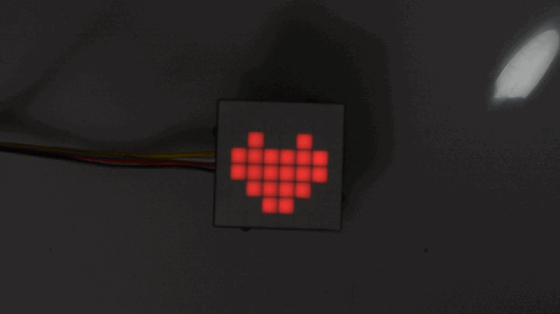
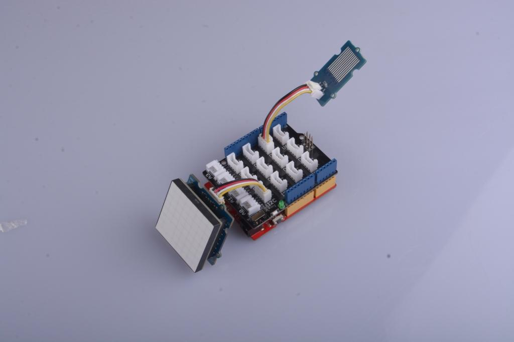
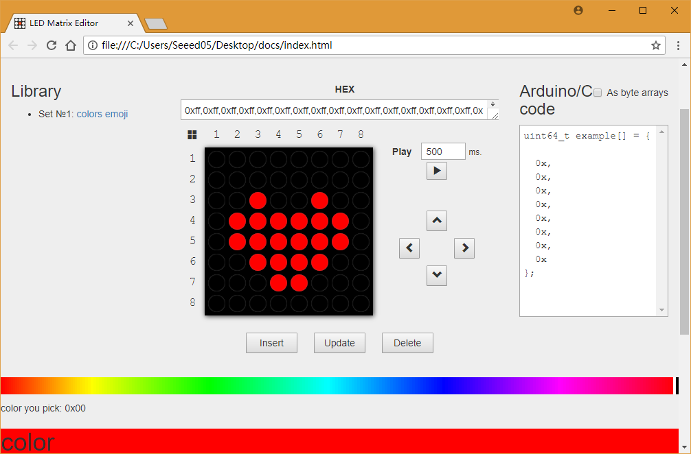
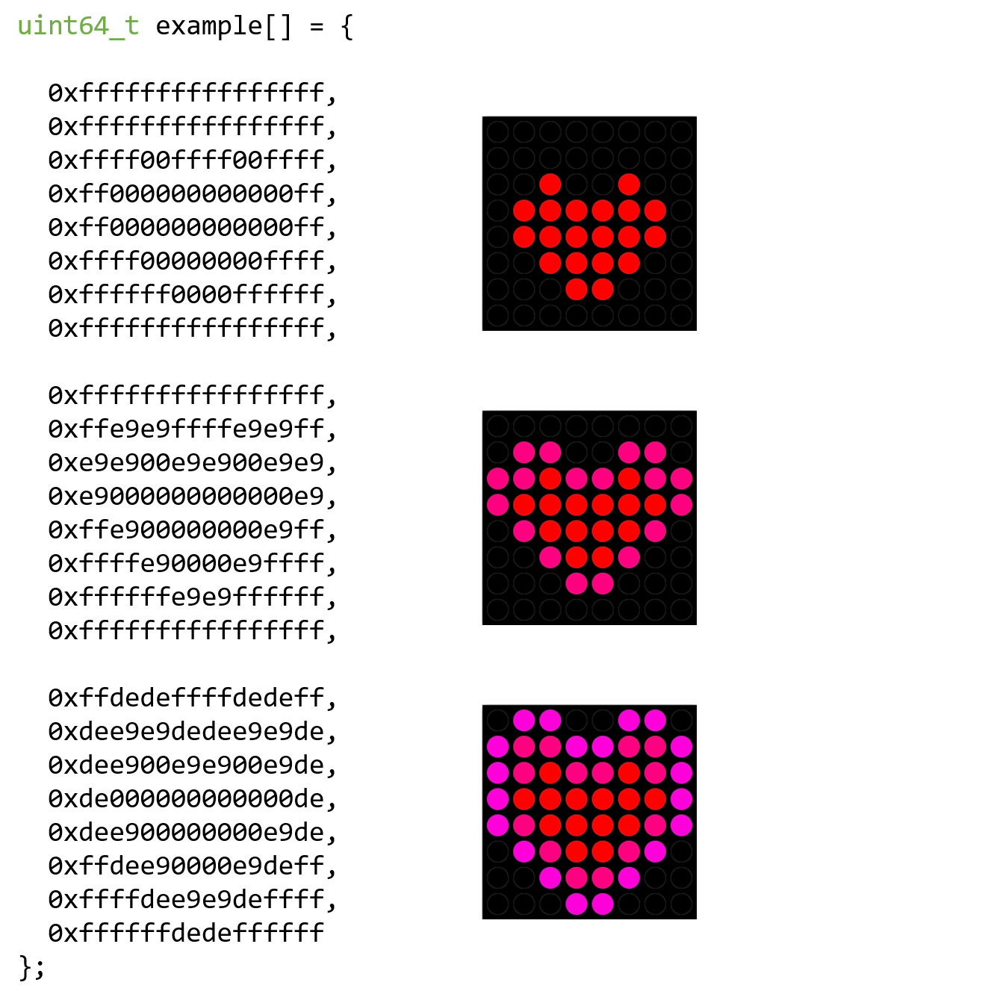

# Light Up Your Valentine with Infinite RGB Matrix Sparkle
Valentine's Day is coming, do you meet someone who fell in love at first sight?



## Things used in this project
### Hardware components
- Seeeduino V4.2
- Base Shield
- Grove - RGB LED Matrix w/Driver
- Grove - Water Sensor

### Software apps and online services
- Arduino IDE

## Story
### Hardware Connection



In this project, we use a water sensor to detecte water, if there is water, a beating heart will be displayed in RGB LED Matrix.

In order to achieve this effect, you need to connect Grove - Water Sensor to D2 port in Base Shield, and also connect Grove - RGB LED Matrix to I2C port in it. Then plug Base Shield to Seeeduino, just like the picture above.

### Software Programming
To use RGB LED matrix in your program, you need to add it's library to your Arduino IDE. The library can be downloaded in

- [Seeed_RGB_LED_Matrix](https://github.com/Seeed-Studio/Seeed_RGB_LED_Matrix)

After adding the library, include matrix's header file in your code

```
#include "grove_two_rgb_led_matrix.h"
```

Definning macros is a good habit, it can make your code easier to read or modify. For example, you can define macros to indicate which port the water sensor connected to, or what speed should the beating heart show.

```
#define SENSOR_PIN  2
#define INTERVAL    500
```

When everything is done, declare a matrix instance for later use.

```
GroveTwoRGBLedMatrixClass matrix;
```

And click [here](https://github.com/SeeedDocument/Grove-RGB_LED_Matrix_w-Driver/raw/master/res/docs.zip) to get image editor to create your own image. Choosing color in color bar, clicking dots in drawing area to draw, and pushing Update or Insert button in bottom of drawing area, your image will be converted to code and appear in the box on the right.



My image looks like below. Copy that code to your project, then you can start display your draw by coding.



In Arduino, setup() method will be run once when your program starts, so we initialize matrix and water sensor pin in it.

```
void setup() {
    Wire.begin();
    pinMode(SENSR_PIN, INPUT);
    
    WAIT_MATRIX_READY();
}
```

loop() method will run repeatedly, so we use it to detected if there is water or not by following code:

```
if (digitalRead(SENSOR_PIN) == LOW) {
}
```

When water sensor outputs LOW, it means there is water, so beating heart should be displayed in RGB LED matrix

```
for (uint8_t i = 0; i < EMOJI_COUNT(example); ++i) {
    matrix.displayFrames(EMOJI(example, i), INTERVAL, false, 1);
    delay(INTERVAL);
}
```

The completed loop() method looks like below:

```
void loop() {
  if (digitalRead(SENSOR_PIN) == LOW) {
    for (uint8_t i = 0; i < EMOJI_COUNT(example); ++i) {
      matrix.displayFrames(EMOJI(example, i), INTERVAL, false, 1);
      delay(INTERVAL);
    }
  }
}
```

Click Upload button in Arduino IDE to upload your program to Seeeduino, and try to put something wet to water sensor, see what happens.

**IMPORTANT:**
In this version firmware if you want to diy your own image with UNO serial you need to modify the file of arduino. If you use mega or lotus, the change will not be needed.

Locate the arduino setup folder `xxxxx\Arduino\hardware\arduino\avr\libraries\Wire\src`, open the `Wire.h` file

change
```
#define BUFFER_LENGTH 32
```

into
```
#define BUFFER_LENGTH 128
```

Then locate the arduino setup folder `xxxxx\Arduino\hardware\arduino\avr\libraries\Wire\src\utility`, open the `twi.h` file.

change
```
#define TWI_BUFFER_LENGTH 32
```

into
```
#define TWI_BUFFER_LENGTH 128
```
